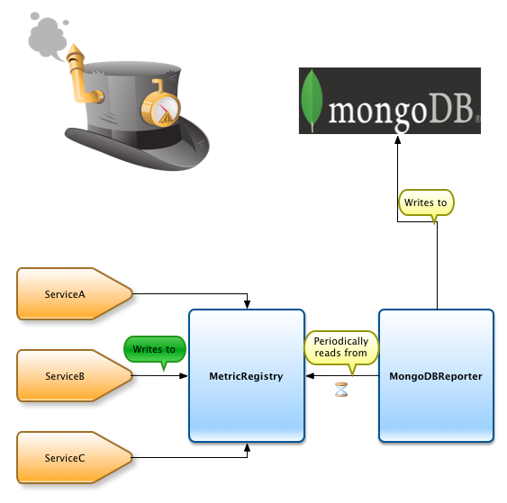

# mongodb-metrics-reporter

[](https://github.com/keawe-software/mongodb-metrics-reporter/actions) [](https://www.apache.org/licenses/LICENSE-2.0.html) 

*MongoDB-Metrics-Reporter* provides a reporter for CodaHale/DropWizard Metrics library to store the metric data in MongoDB.
This is a fork of [aparnachaudhary/mongodb-metrics-reporter](https://github.com/aparnachaudhary/mongodb-metrics-reporter), which seems to be *discontinued*.

## How does it work?

1. Define MetricsRegistry which is a JVM wide singleton for metric data
2. Metrics Reporter is associated with the Metrics Registry
3. Application services are instrumented with DropWizard Metrics
4. The reporter reads the data from registry at fixed defined interval and writes this data to the MongoDB datastore is the relevant collection



## Build Requirements:

* Apache Maven version 3.x
* Java8

## Building

Clone the repository using command

```bash
git clone git://github.com/aparnachaudhary/mongodb-metrics-reporter.git
```

To build, issue this from the command line

```bash
mvn clean install
```

## Dependencies

The module has following compile time dependencies

* io.dropwizard.metrics:metrics-core:jar:4.1.9
* org.mongodb:mongo-java-driver:jar:3.12.5
* org.slf4j:slf4j-api:jar:1.7.30

## Documentation
Refer to the [documents in the doc](doc/index.md) directory.
