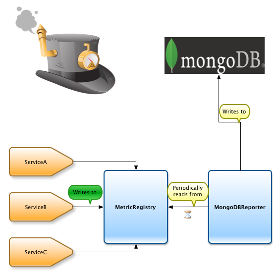

# Introduction

The __mongodb-metrics__ module provides __MongoDBReporter__, which allows your application to constantly stream metric values to a MongoDB server.

[getting started] | [Java SE] | [Java EE]

[getting started]: getting_started.md
[Java SE]: Java_SE.md
[Java EE]: Java_EE.md
